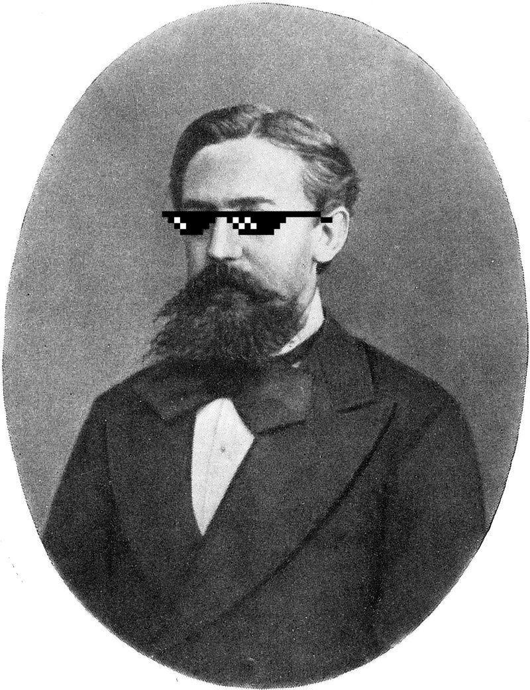

# HiddenMarkovModels.jl &nbsp;&nbsp;&nbsp;&nbsp;&nbsp;&nbsp;&nbsp; 

A Julia package for HMM modeling, simulation, inference and learning.

> This is an experimental package and the interface is not yet stable. If you find something wrong or missing, please open an issue!

Take a look at the [documentation](https://gdalle.github.io/HiddenMarkovModels.jl/stable/) to know more!
