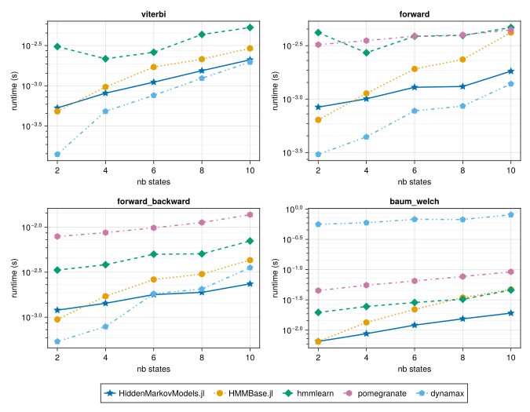

# Summary

Hidden Markov Models (or HMMs) are a very popular statistical framework, with numerous applications ranging from speech recognition to bioinformatics.
They characterize a sequence of _observations_ $Y_1, \dots, Y_T$ by assuming the existence of a hidden sequence of _states_ $X_1, \dots, X_T$.
The distribution of a state $X_t$ can only depend on the previous state $X_{t-1}$, and the distribution of an observation $Y_t$ can only depend on the current state $X_t$.
In addition, both of these dynamics may be influenced by exogenous control variables $U_1, \dots, U_T$.
This is a very versatile and practical set of assumptions: see @rabinerTutorialHiddenMarkov1989 for an introduction, @cappeInferenceHiddenMarkov2005 for a book-length treatment and @bengioInputOutputHMM1994 for a seminal discussion of HMMs with controls.

Given a sequence of observations and a parametric family of HMMs $\mathbb{P}_\theta$, there are several problems one can face.
In generic graphical models, these problems are often intractable, but HMMs have a tree-like structure that yields exact solution procedures with polynomial complexity.
The package `HiddenMarkovModels.jl` leverages the Julia language [@bezansonJuliaFreshApproach2017] to implement those algorithms in a _generic_, _fast_ and _reliable_ way.

| Inference problem                                                                                              | Algorithm        |
| -------------------------------------------------------------------------------------------------------------- | ---------------- |
| Best state sequence              $\mathrm{argmax}_{X_{1:T}}~\mathbb{P}_\theta(X_{1:T} \vert Y_{1:T}, U_{1:T})$ | Viterbi          |
| Observation sequence likelihood  $\mathbb{P}_\theta(Y_{1:T} \vert U_{1:T})$                                    | Forward          |
| State marginals                  $\mathbb{P}_\theta(X_t \vert Y_{1:T}, U_{1:T})$                               | Forward-backward |
| Maximum likelihood parameter     $\mathrm{argmax}_\theta~\mathbb{P}_\theta(Y_{1:T} \vert U_{1:T})$             | Baum-Welch       |

# Statement of need

The initial motivation for HiddenMarkovModels.jl was an application of HMMs to reliability analysis for the French railway company SNCF [@dalleMachineLearningCombinatorial2022].
In this industrial use case, the observations were marked temporal point processes (sequences of timed events with structured metadata) generated by condition monitoring systems, possibly influenced by the daily activity of the train unit.

Unfortunately, nearly all implementations of HMMs we surveyed (in Julia and Python) expect the observations to be generated by a _predefined set of distributions_, with _no temporal heterogeneity_.
In Julia, the previous reference package `HMMBase.jl` [@mouchetHMMBaseJlHidden2023] requires compliance with the `Distributions.jl` [@besanconDistributionsJlDefinition2021] interface, which precludes anything not scalar- or array-valued, let alone point processes.
In Python, the `numpy`-based `hmmlearn` [@hmmlearndevelopersHmmlearnHiddenMarkov2023] and the `PyTorch`-based `pomegranate` [@schreiberPomegranateFastFlexible2018] each offer a catalogue of discrete and continuous distributions, but do not allow for easy extension by the user.
The more recent `JAX`-based `dynamax` [@changDynamaxStateSpace2024] is the only package adopting an extensible interface with optional controls, similar to ours.

Focusing on Julia specifically, other downsides of `HMMBase.jl` include the lack of support for _multiple observation sequences_, _automatic differentiation_, _sparse transition matrices_ or _number types beyond 64-bit floating point_.
Two other Julia packages each provide a subset of functionalities that `HMMBase.jl` lacks, namely `HMMGradients.jl` [@antonelloHMMGradientsJlEnables2021] and `MarkovModels.jl` [@ondelGPUAcceleratedForwardBackwardAlgorithm2022], but they are less developed and ill-suited to uninformed users.

# Package design

`HiddenMarkovModels.jl` was designed to overcome the limitations mentioned above, following a few guiding principles.

Our package is _generic_.
Observations can be arbitrary objects, and the associated distributions only need to implement two methods: a loglikelihood `logdensityof(dist, x)` and a sampler `rand(rng, x)`.
Number types are not restricted, and automatic differentiation of the sequence loglikelihood [@qinDirectOptimizationApproach2000] is supported both in forward and reverse mode, partly thanks to `ChainRulesCore.jl` [@whiteJuliaDiffChainRulesJl2022].
The extendable `AbstractHMM` interface allows incorporating features such as priors or structured transitions, as well as temporal or control dependency, simply by redefining three methods:

```julia
initialization(hmm)
transition_matrix(hmm, control)
obs_distributions(hmm, control)
```

Our package is _fast_.
Julia's blend of multiple dispatch and just-in-time compilation delivers satisfactory speed even when working with unexpected types that Python's tensor backends could not easily handle.
Inference routines rely on BLAS calls for linear algebra, and exploit multithreading to process sequences in parallel.

Our package is _reliable_.
It is thoroughly tested and documented, with an extensive API reference and accessible tutorials.
Special care was given to code quality, type stability, and compatibility checks with various downstream packages (like automatic differentiation packages).

However, our package is also _limited in scope_.
It aims at CPU efficiency for moderately-sized state spaces, and remains untested on GPU.
Furthermore, it does not manipulate probabilities in the logarithmic domain, but instead uses the scaling trick [@rabinerTutorialHiddenMarkov1989] with a variation borrowed from `HMMBase.jl`.
Thus, its numerical stability might be worse than that of Python counterparts on challenging instances.
Luckily, thanks to unrestricted number types, users are free to bring in third-party packages like `LogarithmicNumbers.jl` [@rowleyLogarithmicNumbersJlLogarithmic2023] to recover additional precision.

# Benchmarks

We compare `HiddenMarkovModels.jl`, `HMMBase.jl`, `hmmlearn`, `pomegranate` and `dynamax` on a test case with univariate Gaussian observations.
The reason for this low-dimensional choice is to spend most of the time in the generic HMM routines themselves, as opposed to the loglikelihood computations which are problem-specific.
The data consists of $50$ independent sequences of length $100$ each, with a number of states varying from $2$ to $10$, to which we apply all inference algorithms (with Baum-Welch performing $5$ iterations).

All benchmarks were run from Julia with `BenchmarkTools.jl` [@chenRobustBenchmarkingNoisy2016], calling Python with `PythonCall.jl` [@rowleyPythonCallJlPython2022], and plotting results with `CairoMakie.jl` [@danischMakieJlFlexible2021].
The comparison code imports `HiddenMarkovModels.jl` version 0.5.0 (commit [9e0b7ab](https://github.com/gdalle/HiddenMarkovModels.jl/commit/9e0b7ab955866523551efbc42813adc4d2b1e3dd)), and it is accessible in the [`libs/HMMComparison/`](https://github.com/gdalle/HiddenMarkovModels.jl/tree/9e0b7ab955866523551efbc42813adc4d2b1e3dd/libs/HMMComparison) subfolder of our GitHub repository.
We tried to minimize parallelism effects by running everything on a single thread, and made the assumption that the Julia-to-Python overhead is negligible compared to the algorithm runtime.



As we can see, `HiddenMarkovModels.jl` is the fastest option in Julia, and the second-fastest overall behind `dynamax` (we think the large runtimes of `dynamax` in Baum-Welch might stem from [incorrect benchmarks](https://github.com/probml/dynamax/issues/359)).
The key observation is that we achieved this speedup over `HMMBase.jl` while _simultaneously increasing generality_ in half a dozen different ways.

# Conclusion

`HiddenMarkovModels.jl` fills a longstanding gap in the Julia package ecosystem, by providing an efficient and flexible framework for state space modeling.

# Acknowledgements

Work on this package started during my PhD at École des Ponts, in partnership with SNCF Réseau and SNCF Voyageurs, whose support I acknowledge.
It continued during my postdoctoral position at EPFL.

My gratitude goes to Maxime Mouchet and Jacob Schreiber, the developers of `HMMBase.jl` and `pomegranate` respectively, for their help and advice.
In particular, Maxime agreed to designate `HiddenMarkovModels.jl` as the official successor to `HMMBase.jl`, for which I thank him.

# References