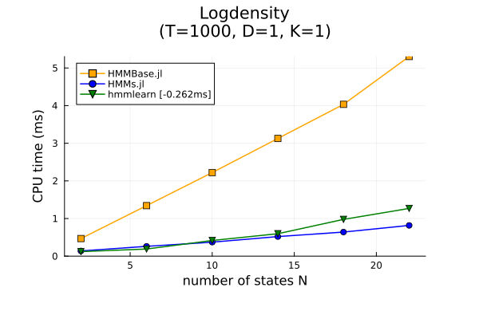
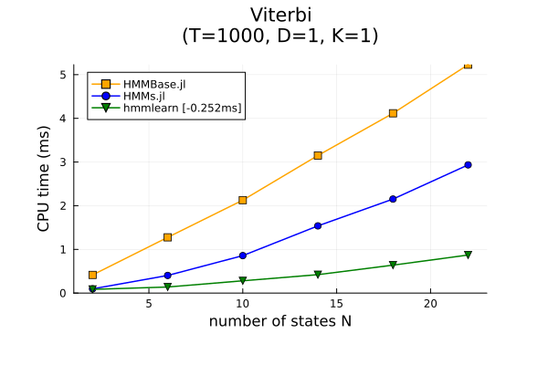
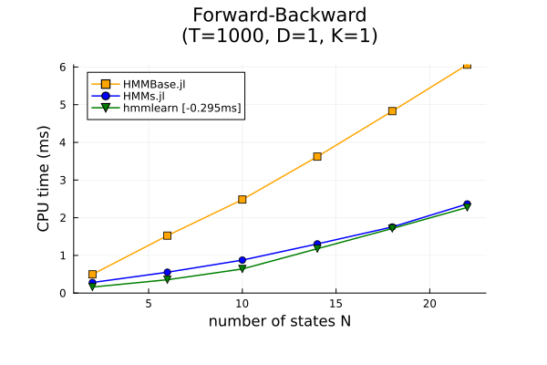
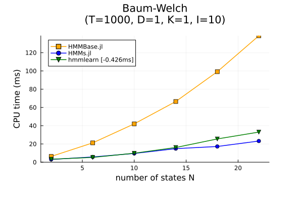
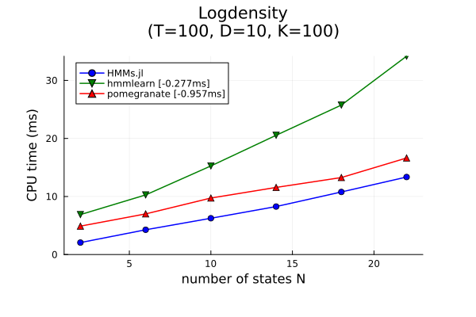
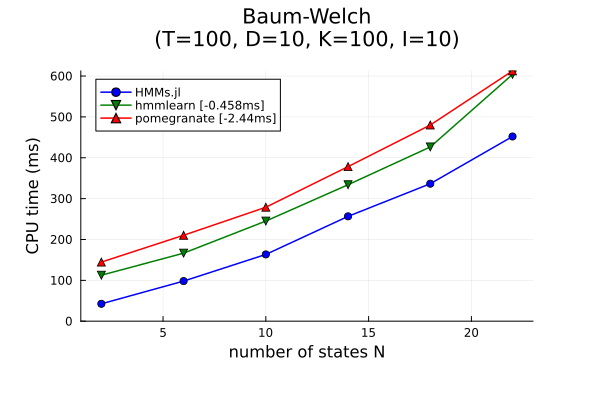

# Summary

Hidden Markov Models (or HMMs) are a very popular statistical framework, with numerous applications ranging from speech recognition to bioinformatics.
They model a sequence of _observations_ $Y_1, \dots, Y_T$ by assuming the existence of a hidden sequence of _states_ $X_1, \dots, X_T$.
The distribution of a state $X_t$ can only depend on the previous state $X_{t-1}$, and the distribution of an observation $Y_t$ can only depend on the current state $X_t$.
This is a very versatile and practical set of assumptions: see @rabinerTutorialHiddenMarkov1989 for an introduction and @cappeInferenceHiddenMarkov2005 for a book-length treatment.

Given a sequence of observations and a parametric family of HMMs, there are several problems one can face: computing the logdensity, decoding the underlying state sequence, or estimating the most likely parameter.
For generic graphical models, these problems are often intractable, but HMMs have a tree-like structure that yields exact solution procedures with polynomial complexity.
The package [`HiddenMarkovModels.jl`](https://github.com/gdalle/HiddenMarkovModels.jl) leverages the Julia language [@bezansonJuliaFreshApproach2017] to implement those algorithms (forward-backward, Viterbi, Baum-Welch) in a _generic_, _fast_ and _reliable_ way.

# Statement of need

The initial motivation for HiddenMarkovModels.jl was an application of HMMs to reliability analysis for the French railway company SNCF [@dalleMachineLearningCombinatorial2022].
In this industrial use case, the observations were marked temporal point processes (sequences of timed events with structured metadata) generated by condition monitoring systems.
Such data is cumbersome to vectorize, which is why developing in Julia was a natural choice to retain performance and readability.

For years, the reference Julia implementation of HMMs has been [`HMMBase.jl`](https://github.com/maxmouchet/HMMBase.jl) [@mouchetHMMBaseJlHidden2023].
Its major flaw is that it can only handle observation distributions from [`Distributions.jl`](https://github.com/JuliaStats/Distributions.jl) [@besanconDistributionsJlDefinition2021].
This precludes observations that are not scalar- or array-valued, and makes it harder for users to experiment with custom distributions.
Note that a similar restriction is shared by the major competitors from the Python world, namely [`hmmlearn`](https://github.com/hmmlearn/hmmlearn) [@hmmlearnHmmlearnHiddenMarkov2023] and [`pomegranate`](https://github.com/jmschrei/pomegranate) [@schreiberPomegranateFastFlexible2018a].

Other downsides of `HMMBase.jl` include the lack of support for multiple observation sequences, and the mandatory use of 64-bit floating point numbers.
Two other packages provide functionalities that `HMMBase.jl` lacks: [`HMMGradients.jl`](https://github.com/idiap/HMMGradients.jl) [@antonelloHMMGradientsJlEnables2021] contains a differentiable loglikelihood function, while [`MarkovModels.jl`](https://github.com/FAST-ASR/MarkovModels.jl) [@ondelGPUAcceleratedForwardBackwardAlgorithm2021] focuses on GPU acceleration.
Unfortunately, all three have mutually incompatible APIs.

# Package design

`HiddenMarkovModels.jl` tries to offer the best of all worlds by being...

* _Generic_. Observations can be arbitrary objects, and the associated distributions only need to implement a logdensity and a sampler. The extendable `AbstractHMM` interface allows incorporating features such as priors or structured transition matrices. Number types are not restricted, and automatic differentiation of the logdensity [@qinDirectOptimizationApproach2000] is supported both in forward and reverse mode.
* _Fast_. Julia's blend of multiple dispatch and just-in-time compilation delivers satisfactory speed even when working with arbitrary observations. Inference routines rely on BLAS calls for linear algebra, and exploit multithreading to process observation sequences in parallel.
* _Reliable_. The package is thoroughly tested and documented, with an extensive API reference and accessible tutorials. Special care was given to code quality, type stability, and compatibility checks with various downstream packages (e.g. exotic array or number types).

Naturally, `HiddenMarkovModels.jl` is also _limited in scope_.
It is centered around CPU efficiency, and untested on GPU.
Furthermore, its primary target is small- to medium-sized HMMs (a few tens of states), mostly because memory requirements scale quadratically for the chosen storage mode.
Finally, it does not perform probability computations in the logarithmic domain, but instead uses the scaling trick from @rabinerTutorialHiddenMarkov1989 with a clever variation borrowed from `HMMBase.jl`.
Thus, its numerical stability might be lower than that of `hmmlearn` or `pomegranate` in challenging instances.
However, thanks to unrestricted number types, users are free to bring in third-party packages like [`LogarithmicNumbers.jl`](https://github.com/cjdoris/LogarithmicNumbers.jl) [@rowleyLogarithmicNumbersJlLogarithmic2023] for additional precision.

# Benchmarks

We compare `HiddenMarkovModels.jl` (abbreviated to `HMMs.jl`), `HMMBase.jl`, `hmmlearn` and `pomegranate` on a test case with multivariate Gaussian observations.
The relevant parameters are the number of states `N`, the sequence duration `T`, the observation dimension `D`, the number of sequences `K` and the number of Baum-Welch iterations `I`.
This benchmarking code is run automatically by GitHub Actions upon each package release, we based our plots on [this specific reproducible run](https://github.com/gdalle/HiddenMarkovModels.jl/actions/runs/6160848637/job/16718719552).

For a single observation sequence, we exclude `pomegranate` because it is too slow.
The following plots show that `HiddenMarkovModels.jl` runs substantially faster than its predecessor `HMMBase.jl`, even though their algorithms are mathematically identical.
We note that performance is less convincing for the Viterbi algorithm, in which linear algebra operations are replaced by max-plus operations (and thus less easy to optimize). 

{ width=50% }
{ width=50% }

{ width=50% }
{ width=50% }

For multiple sequences we exclude `HMMBase.jl` because it does not support this setting.
The following plots demonstrate that `HiddenMarkovModels.jl` scales favorably compared to both Python alternatives, even though the latter make use of highly optimized C++ backends (NumPy and PyTorch respectively).
This can be partially explained by the absence of logarithmic computations.

{ width=40% }
{ width=40% }

See the package documentation for more details on the benchmarks (which are possibly biased against Julia), as well as a mathematical description of the algorithms involved.

# Conclusion

`HiddenMarkovModels.jl` fills a longstanding gap in the Julia package ecosystem, and might even prove interesting for Python users.
Future research directions include the implementation of Input-Output HMMs [@bengioInputOutputHMM1994] as well as other estimation methods (gradient-based or spectral).

# Acknowledgements

A special thank you goes to Maxime Mouchet and Jacob Schreiber, the developers of `HMMBase.jl` and `pomegranate` respectively, for their help and advice.
In particular, Maxime agreed to designate `HiddenMarkovModels.jl` as the official successor to `HMMBase.jl`, which I am very grateful for.

# References